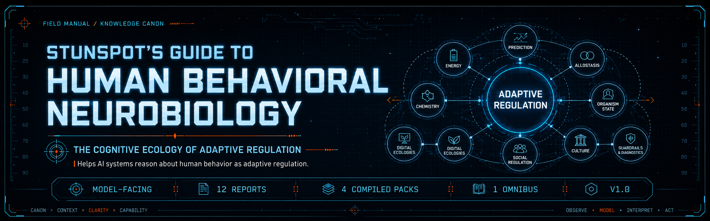

<p align="center">
  
</p>

# Stunspot's Guide to Human Behavioral Neurobiology

**The Cognitive Ecology of Adaptive Regulation**  
*A model-facing canon for interpreting human behavior as embodied, predictive, metabolically constrained, socially regulated, culturally patterned, and ecologically situated.*


[](https://doi.org/10.5281/zenodo.21039283)

*Stunspot's Guide to Human Behavioral Neurobiology* is a Markdown-native knowledge canon built primarily for AI/RAG ingestion, long-context reasoning, project knowledge bases, and model-facing behavioral interpretation.

Its main audience is the model.

When loaded into an AI workspace, retrieval pipeline, long-context session, agent memory layer, or project knowledge base, this canon gives the assisting model a disciplined map of human behavior as a nested regulatory ecology: prediction, allostasis, metabolic constraint, chemical tuning, social baseline, cultural priors, digital attention capture, feedback loops, and diagnostic guardrails.

Human readers can use it as a systems-literate field reference. Its deeper purpose is practical augmentation: to help AI systems reason about human behavior without collapsing into folk psychology, neurotransmitter mythology, moralized personality labels, or clinical overreach.

At its core is a simple interpretive premise:

> Human behavior is not an isolated output of "the brain" or "personality." It emerges from embodied prediction, energy budgets, autonomic state, social regulation, cultural scaffolding, affordance landscapes, and feedback loops operating across nested timescales.

Use it as reference material.  
Use it as RAG substrate.  
Use it as model doctrine for behavioral analysis.  
Use it as a guardrail against lazy neuro-reductionist nonsense wearing a lab coat.

---

## Start Here

- [Canon Map](./docs/canon-map.md) — report sequence, conceptual architecture, and volume logic.
- [How to Use This Canon](./docs/how-to-use-this-canon.md) — practical guidance for humans, AI assistants, RAG systems, and long-context workflows.
- [Knowledge Packs](./docs/knowledge-packs.md) — upload-format recommendations by use case.

## Corpus Shape

- **12 source reports** in [`knowledge-packs/by-report/`](./knowledge-packs/by-report/)
- **4 compiled packs** in [`knowledge-packs/compiled-packs/`](./knowledge-packs/compiled-packs/)
- **1 omnibus file** in [`knowledge-packs/omnibus/`](./knowledge-packs/omnibus/)

`docs/` is the navigation and GitHub Pages layer. The individual source-report corpus lives in `knowledge-packs/by-report/`; grouped upload bundles live in `knowledge-packs/compiled-packs/`; the whole-corpus bundle lives in `knowledge-packs/omnibus/`.

No report files are duplicated under `docs/`, and this repository does **not** use `docs/reports/`.

---

## What This Canon Covers

The canon is organized across **4 volumes** and **12 reports**, from **A** through **L**.

It covers:

- field ontology, levels of analysis, Markov-blanket framing, causal-boundary discipline, and scale-free regulatory ecology
- operational epistemology, evidence tiers, causal humility, proxy-measurement limits, and claim-warrant grammar
- predictive processing, active inference, precision weighting, policy selection, interoception, and allostatic control
- neuroenergetics, metabolic budgets, cognitive control cost, fatigue signaling, and recovery debt
- neuromodulators, endocrine signaling, immune cytokines, motivational tuning, effort valuation, and state switching
- stress, sleep, autonomic dynamics, immune signaling, and organism-level recovery architecture
- behavioral ecology, affordance landscapes, scarcity, constraint, decision pressure, and action-policy economics
- social baseline theory, coalition dynamics, status, shame, belonging, social regulation, and relational load sharing
- culture, narrative, ideology, rituals, symbols, collective prediction systems, and identity scripts
- digital attention ecologies, algorithmic capture, platform-shaped cognition, and engineered uncertainty loops
- feedback loops, nonlinear breakdown, phase transitions, attractor states, systemic failure modes, and repair dynamics
- state-trait differentiation, differential mapping, diagnostic guardrails, measurement artifacts, and category-error prevention

---

## Core Volumes

### Volume 1 — A-D: Foundations of Adaptive Regulation

This volume establishes the canon's operating frame: human behavior as embodied adaptive regulation across nested biological, cognitive, social, and cultural scales. It defines the field ontology, evidence discipline, predictive-control engine, and metabolic ledger.

### Volume 2 — E-G: Major Operating Domains I

This volume maps the internal and ecological tuning systems that shape policy selection: chemical signaling, sleep-stress-immunity dynamics, and the affordance landscapes that make some actions cheap, costly, available, forbidden, or invisible.

### Volume 3 — H-J: Major Operating Domains II

This volume scales behavior into social and symbolic environments: coalition regulation, status, shame, belonging, culture, narrative, ideology, collective prediction systems, and digital platforms as engineered attention ecologies.

### Volume 4 — K-L: Constraint, Breakdown, and Diagnostic Layers

This volume provides the failure and interpretation layer: nonlinear feedback loops, phase transitions, systemic breakdown, state-trait confusion, differential mapping, and practical guardrails against unsupported diagnosis or moralized behavioral labeling.

---

## Who This Is For

This canon is written for AI systems and the humans directing them:

- **AI/RAG builders** creating behavior-analysis knowledge bases, retrieval corpora, or model-facing doctrine
- **prompt engineers and persona designers** who need richer behavioral mechanics than generic psychology tropes
- **analysts and strategists** modeling human action under constraint, scarcity, uncertainty, stress, social pressure, or platform capture
- **coaches, educators, and organizational designers** who need ecological interpretations rather than personality blame
- **writers and worldbuilders** building psychologically plausible agents, cultures, institutions, and social dynamics
- **serious learners** who want a systems map of human behavior without drowning in isolated neuroscience trivia

It is **not** a medical device, clinical diagnostic protocol, therapeutic substitute, or individualized treatment guide.

---

## How To Read It

The canon can be read straight through, but most readers should enter through their problem.

### If you are building an AI/RAG knowledge base

Start with the [Knowledge Packs guide](./docs/knowledge-packs.md), then load the **compiled packs** unless your system needs individual report-level citation control.

### If you want the conceptual spine

Read:

1. [A. Field Ontology, Levels of Analysis, and Causal Boundaries](./knowledge-packs/by-report/a-field-ontology-levels-of-analysis-and-causal-boundaries.md)
2. [B. Operational Epistemology, Evidence Tiers, and Causal Humility](./knowledge-packs/by-report/b-operational-epistemology-evidence-tiers-and-causal-humility.md)
3. [C. Predictive Processing, Active Inference, and Allostatic Control](./knowledge-packs/by-report/c-predictive-processing-active-inference-and-allostatic-control.md)
4. [D. Neuroenergetics, Metabolic Constraint, and the Cost of Cognition](./knowledge-packs/by-report/d-neuroenergetics-metabolic-constraint-and-the-cost-of-cognition.md)

### If you are interpreting behavior under pressure

Start with:

1. [G. Behavioral Ecology, Affordance Landscapes, and Decision Under Constraint](./knowledge-packs/by-report/g-behavioral-ecology-affordance-landscapes-and-decision-under-constraint.md)
2. [H. Social Regulation, Coalition Dynamics, Status, Shame, and Belonging](./knowledge-packs/by-report/h-social-regulation-coalition-dynamics-status-shame-and-belonging.md)
3. [K. Feedback Loops, Phase Transitions, and Systemic Failure Modes](./knowledge-packs/by-report/k-feedback-loops-phase-transitions-and-systemic-failure-modes.md)
4. [L. State–Trait Differentiation, Differential Mapping, and Diagnostic Guardrails](./knowledge-packs/by-report/l-statetrait-differentiation-differential-mapping-and-diagnostic-guardrails.md)

### If you are modeling culture, ideology, or platform capture

Start with:

1. [I. Culture, Narrative, Ideology, and Collective Prediction Systems](./knowledge-packs/by-report/i-culture-narrative-ideology-and-collective-prediction-systems.md)
2. [J. Digital Attention Ecologies, Algorithmic Capture, and Platform-Shaped Cognition](./knowledge-packs/by-report/j-digital-attention-ecologies-algorithmic-capture-and-platform-shaped-cognition.md)
3. [K. Feedback Loops, Phase Transitions, and Systemic Failure Modes](./knowledge-packs/by-report/k-feedback-loops-phase-transitions-and-systemic-failure-modes.md)

---

## Repository Structure

```text
.
├── README.md
├── LICENSE.md
├── CITATION.cff
├── CHANGELOG.md
├── STATUS.md
├── MANIFEST.md
├── manifest.json
├── docs/
│   ├── index.md
│   ├── canon-map.md
│   ├── how-to-use-this-canon.md
│   ├── knowledge-packs.md
│   ├── _config.yml
│   ├── _layouts/
│   │   └── default.html
│   └── assets/
│       ├── brand/
│       │   ├── coldwire-bg.jpg
│       │   ├── readme-hero.png        # referenced placeholder; image asset to be added later
│       │   ├── pages-hero.png         # referenced placeholder; image asset to be added later
│       │   └── social-preview.png     # referenced placeholder; image asset to be added later
│       └── css/
│           └── style.css
└── knowledge-packs/
    ├── by-report/
    │   └── 12 individual source reports
    ├── compiled-packs/
    │   └── 4 grouped upload packs
    └── omnibus/
        └── 1 whole-corpus bundle
```

---

## Citation and License

Version: **1.0**  
Released: **2026-06-28**  
License: **CC BY-NC-SA 4.0**  
Author: **Sam “stunspot” Walker / Collaborative Dynamics**

Citation metadata is available in [`CITATION.cff`](./CITATION.cff). License terms are stated in [`LICENSE.md`](./LICENSE.md).

GitHub: https://github.com/Stunspot/stunspots-guide-to-human-behavioral-neurobiology  
Pages URL, after GitHub Pages is enabled: https://stunspot.github.io/stunspots-guide-to-human-behavioral-neurobiology/

---

## Disclaimer

This corpus is built for education, research, design, reference, AI/RAG augmentation, and model-facing reasoning. It contains systems-level behavioral neurobiology and behavioral ecology material, but it should not be used as a substitute for qualified medical, psychological, psychiatric, legal, or safety-critical professional judgment.

The canon is strongest when used to improve interpretation quality: distinguishing state from trait, constraint from character, adaptive policy from pathology, population-level claim from individual inference, and model from mechanism.

--stunspot | ⟨🤩⨯📍⟩ and 💠‍🌐Nova
