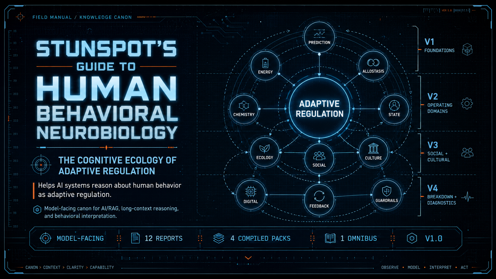

<p align="center">
  
</p>

# Stunspot's Guide to Human Behavioral Neurobiology

**The Cognitive Ecology of Adaptive Regulation**  
*A model-facing canon for interpreting human behavior as embodied, predictive, metabolically constrained, socially regulated, culturally patterned, and ecologically situated.*

This site is the navigation layer for a model-facing behavioral neurobiology canon. The actual corpus lives in the repository under `knowledge-packs/`: individual source reports in `by-report/`, grouped upload bundles in `compiled-packs/`, and the full corpus in `omnibus/`.

The canon is built to help AI systems interpret human behavior as embodied adaptive regulation rather than as isolated brain chemistry, static personality, moral failure, or free-floating cognition. It links predictive processing, allostatic control, energy constraint, neuromodulatory tuning, social baseline, cultural priors, digital attention ecologies, nonlinear feedback, and diagnostic guardrails into one coherent reasoning substrate.

## Start Here

- [Canon Map](./canon-map.md) — the report sequence, volume architecture, and conceptual handoffs.
- [How to Use This Canon](./how-to-use-this-canon.md) — practical guidance for human readers, AI assistants, RAG pipelines, and long-context sessions.
- [Knowledge Packs](./knowledge-packs.md) — which upload format to use and when.

## Corpus at a Glance

| Layer | Count | Repository Path | Purpose |
|---|---:|---|---|
| Source reports | 12 | `knowledge-packs/by-report/` | Canonical individual units for precise retrieval, selective upload, and citation. |
| Compiled packs | 4 | `knowledge-packs/compiled-packs/` | Recommended default for most AI/RAG systems: grouped coverage with lower file count. |
| Omnibus | 1 | `knowledge-packs/omnibus/` | Whole-corpus bundle for archival use, local search, or strong long-context systems. |

## Directory Policy

`docs/` contains navigation, GitHub Pages scaffolding, and public-use guidance. It is not the report corpus.

The report corpus lives here:

```text
knowledge-packs/by-report/      individual source reports
knowledge-packs/compiled-packs/ grouped upload packs
knowledge-packs/omnibus/        whole-corpus bundle
```

No `docs/reports/` directory is used.
